  

 

  

 

  <a href="https://linkedin.com/in/rdemellob">linkedin</a> ·
  <a href="https://www.codewars.com/users/mellozin">codewars</a> ·
  <a href="https://steamcommunity.com/id/poowoo/">steam</a> ·
  <a href="https://retroachievements.org/user/mellorb1">retroachievements</a>

